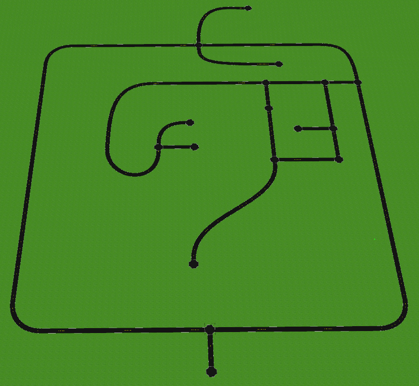
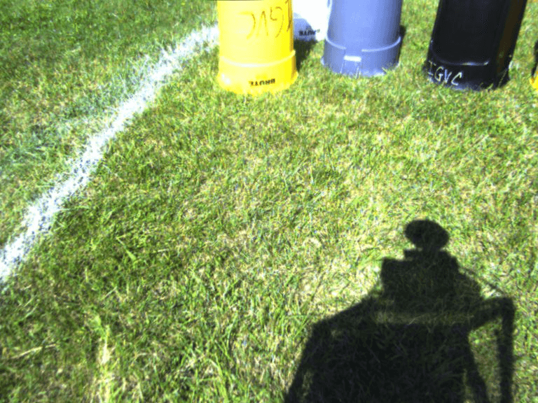
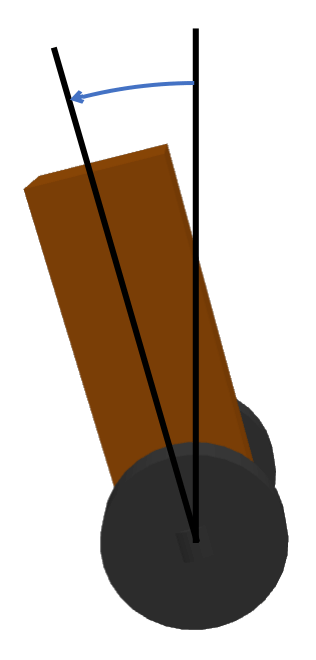
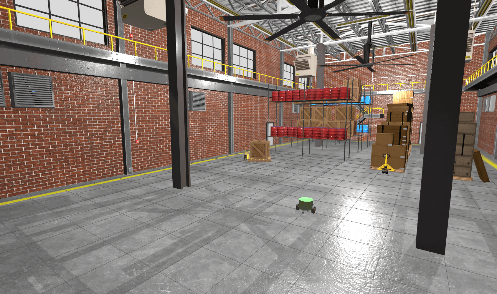

# Project Ideas for ECE 5532
Here are some ideas and starting points for ECE 5532 projects.

## Audibot Urban Navigation

This project uses the same Audibot simulator that was used throughout the course, but it is spawned in a different environment with a camera to detect lane markings.
The goal is to navigate around this world making turns at intersections to reach a destination.
For more details, see the [project-specific README](urban_nav/README.md)

## IGVC Robot Sensor Processing

The Intelligent Ground Vehicle Competition (IGVC) is hosted every year at Oakland University.
IGVC is a collegiate robotics competition where participants build and program an unmanned ground vehicle to navigate an outdoor course consisting of painted lines and obstacles.
Here is a video of a robot running the course at the 2013 competition:
[YouTube Link](https://www.youtube.com/watch?v=Mt4OGEdjHuw)

This project involves processing data from a ROS bag recorded during one of the official runs by Oakland University's team in the 2014 competition and implementing the perception and mapping systems.
For more details, see the [project-specific README](igvc_bag_processing/README.md)

    

## Self-Balancing Robot Control

This project involves implementing a control system for a self-balancing robot in Gazebo by processing simulated IMU data and issuing commands to the wheels of the robot.
For more details, see the [project-specific README](self_balancing_control/README.md)

    

## Warehouse Floor Cleaning

This project involves leveraging the capabilities of the ROS 2 Navigation Stack to implement a floor cleaning algorithm similar to commercial robot vacuums.
Using the same Roundbot with a 2-D lidar from the `maze_nav_example` discussed in lecture, map out the warehouse, and then execute a systematic pattern to clean the floor while avoiding obstacles.
For more details, see the [project-specific README](floor_cleaning/README.md)

    

## Maze Search and Rescue

This project involves using the ROS 2 Navigation Stack and machine vision to search a maze for people and animals.

[more to come]

For more details, see the [project-specific README](search_and_rescue/README.md)