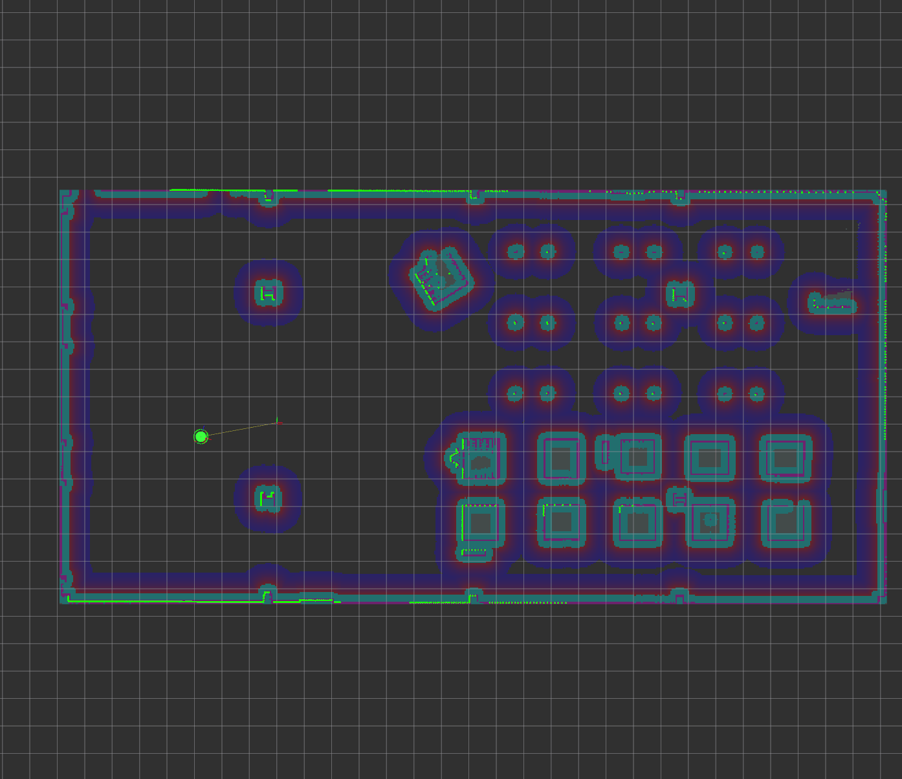

# Warehouse Floor Cleaning

## Objectives

### Level 1: Configure mapping system and basic sweeping
- Using the `maze_nav_example` package from lecture as a guide, add the necessary configuration files to this package to set up the navigation stack to map the warehouse.
- Construct a fixed sequence of waypoints to pass to the Navigation Stack waypoint manager that roughly covers the floor of the warehouse



### Level 2: Implement automatic perimeter detection
- Instead of sending navigation stack goals to explore the warehouse, write a ROS node to follow the outer wall of the warehouse until the robot completes a full loop, thereby finishing the map and establishing the cleaning area.

### Level 3: Fully autonomous system
- After completing the perimeter map, write a node to automatically sweep the area with a reasonably-small amount of overlap.

## Getting Started

This project requires [ece5532_gazebo](https://github.com/robustify/ece5532_gazebo.git) to be cloned in the same ROS workspace as this repository.

After building the workspace, the simulation can be started by launching `floor_cleaning_world.launch.xml`:

```bash
ros2 launch floor_cleaning floor_cleaning_world.launch.xml
```
