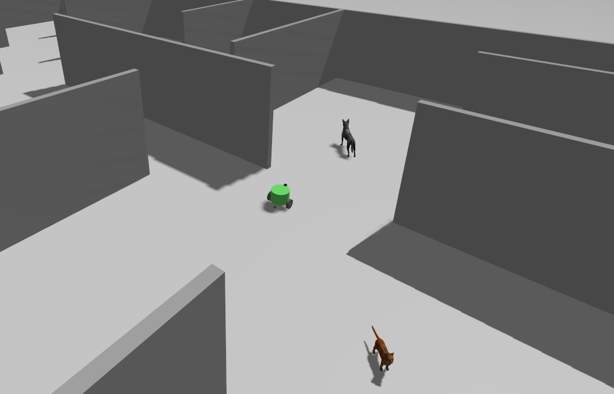
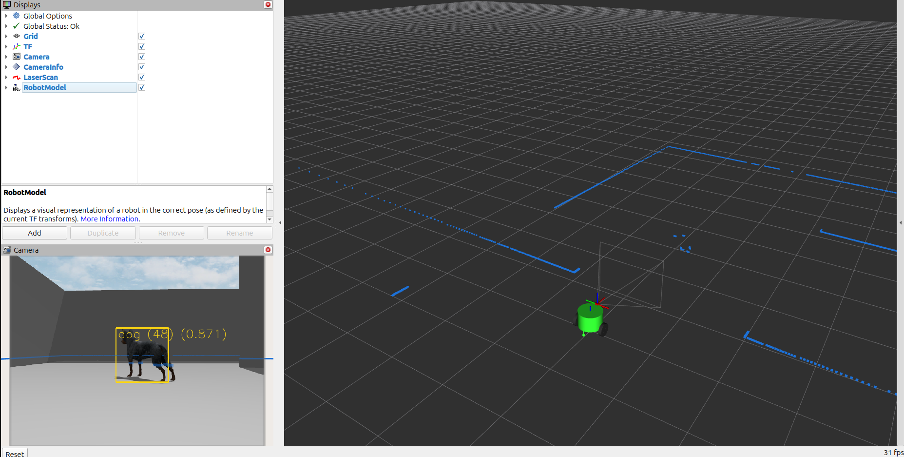

# Building Search and Rescue

This project involves using the ROS 2 Navigation Stack and machine vision to map out a building to search for and locate people and animals.

<p float="left">
  
  
</p>

## Objectives

### Level 1: Configure mapping and computer vision systems
- Using the `maze_nav_example` package from lecture as a guide, add the necessary configuration files to this package to set up the navigation stack to explore and map the building.
- The fixed frame of the initial RViz configuration file is set to the `base_footprint` frame.
Once the navigation system is set up, change this to `map`, add visualizations of the SLAM map, occupancy grid costmaps, etc., and save the configuration.
- Manually explore the building by setting navigation stack goals from RViz.
- Write a node that subscribes to the YOLO detections list topic (`/yolo/detections`) and print out an info message when it sees a person, dog, or cat.

### Level 2: Automate the search
- Instead of manually setting navigation stack goals from RViz, write a node that automatically executes a sequence of goals to systematically explore the building.
- Detect when the robot reaches the goal and then issue the next goal.

### Level 3: Pinpoint the locations of people and animals
- Expand the machine vision capability from level 1 to detect and account for individual people and animals.
  - Correlate the YOLO detections with the LIDAR scan data to detect the position of the people and animals relative to the vehicle.
  - Assuming the people and animals do not move, calculate the global position of each individual in map coordinates, and account for all known occupants of the building:
    - 2 people
    - 2 cats
    - 2 dogs
- JSON is a text format that is commonly used to transmit metadata between systems. Once all individuals are found, export a JSON file containing the global positions of each individual, along with whether the individual is a person, cat, or dog.

## Getting Started

This project requires [ece5532_gazebo](https://github.com/robustify/ece5532_gazebo.git) and [yolo_ros](https://github.com/mgonzs13/yolo_ros.git) to be cloned in the same ROS workspace as this repository.

The Python dependencies for `yolo_ros` must be installed. To do so, open a terminal, `cd` to the `yolo_ros` folder, and install the dependencies with `pip3`:

```bash
pip3 install -r requirements.txt
```

The starting point launch file runs a node from the `topic_tools` package that is not installed by default.
Before trying to run the simulation, be sure to run `deps.bash` from the root folder of your ROS workspace to install this missing package.

After building the workspace, the simulation can be started by launching `search_and_rescue_world.launch.xml`:

```bash
ros2 launch search_and_rescue search_and_rescue_world.launch.xml
```
