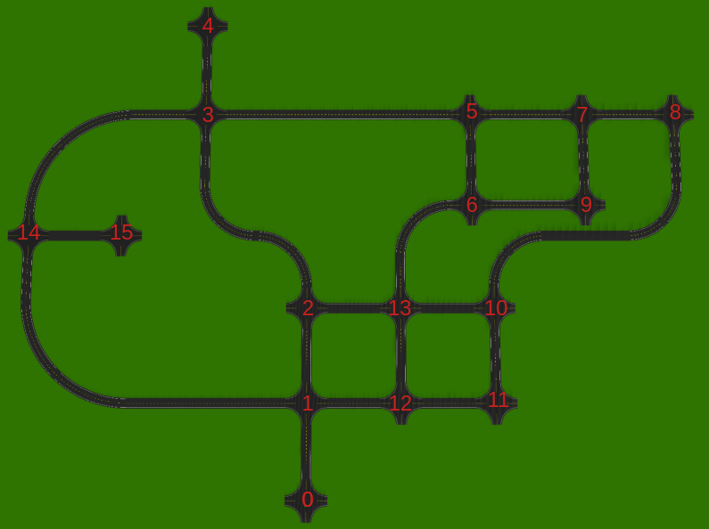
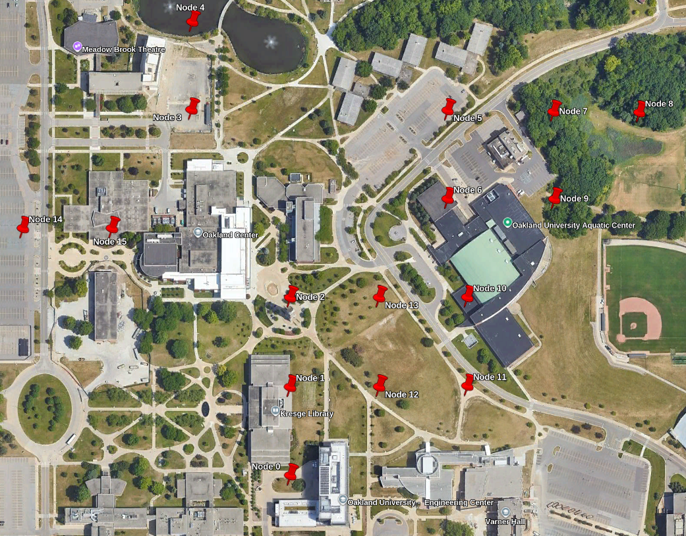

# Audibot Urban Navigation

This project uses the same Audibot simulator that was used throughout the course, but it is spawned in `urban_world` with a camera to detect lane markings.
The goal is to navigate around this world making turns at intersections to reach a destination.

## Objectives

### Level 1: Develop control and logic to navigate intersections

- Use the provided lane keeping package `audibot_lane_keeping` to follow the lane markings between intersections.
- Implement logic to switch the Audibot steering command between lane keeping and turning left or right at an intersection when necessary.
- Construct and execute a pre-determined sequence of turns to reach a particular intersection from the starting position.

### Level 2: Generalize the intersection navigation sequence

- Construct a graph with a node for each intersection and edges between the nodes representing the roads connecting the intersections. The connections between the intersections and the total distance between them can be found in [intersection_graph_info.csv](data/intersection_graph_info.csv).
- Develop an algorithm that searches the graph for a route between arbitrary start and end intersections. From this route, generate a sequence of left, right, and straight intersection actions to get from the start to the end.
- Execute the route using the same logic and controls developed in Level 1.

## Getting Started

This project requires [ece5532_gazebo](https://github.com/robustify/ece5532_gazebo.git) and [audibot](https://github.com/robustify/audibot.git) to be cloned in the same ROS workspace as this repository.

The lane keeping system is provided as a binary package installation.
Before launching the simulation for the first time, install the `.deb` package found in the `data` folder of this ROS package.

```bash
cd data
sudo dpkg -i ros-$ROS_DISTRO-audibot-lane-keeping_0.1.0_amd64.deb
```

After building the workspace where this repository is cloned, the simulation can be started by launching `urban_world.launch.xml`:

```bash
ros2 launch urban_nav urban_world.launch.xml
```

This launch file loads the Gazebo world with the road network, as well as the lane keeping nodes that processes the simulated camera images to steer down the middle of the lane.
If everything is working properly, you should see Audibot successfully drive down the road through each intersection.

## Coordinates of the Intersections

The geodetic coordinates of the center of the intersections is provided in [intersection_coordinates.csv](data/intersection_coordinates.csv).
The number corresponding to each intersection are labeled in `intersection_map.png` so you can see how they are connected to each other.
The X and Y coordinates are the positions of the intersections in the Gazebo world reference frame.
Opening [intersection_coordinates.kml](data/intersection_coordinates.kml) in Google Earth shows where the intersections would be, overlaid on satellite imagery.

<p align="center">
    
    
</p>

## Making Turns at Intersections

Remap the output steering control topic from the lane keeping node (`/audibot/steering_cmd`) to the input topic of your node that implements the steering control and decision logic.
Then remap the output topic from your node to `/audibot/steering_cmd` so it can control the vehicle instead.

While driving along the roads between intersections, just pass through the steering control signal coming from the lane keeping node.
When the vehicle gets close to the next intersection, replace the steering command to make the required maneuver.

## Vehicle Speed

The vehicle speed is a constant configured by the `speed` launch argment in `urban_world.launch.xml`.
To change the speed, intercept `/audibot/speed_cmd` in a similar fashion to the steering command topic.